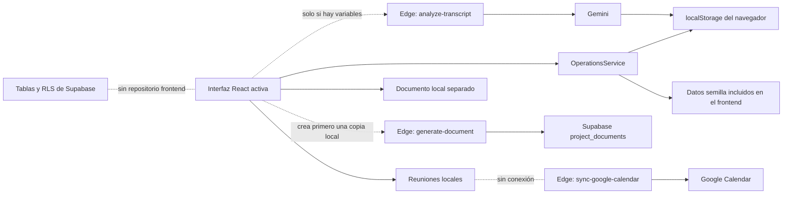

# Informe de auditoría integral

## Veredicto ejecutivo

El sistema actual no está “100% funcional” ni listo para producción. Es un prototipo local navegable que demuestra algunos flujos, pero su arquitectura real todavía está fragmentada:

- La interfaz principal guarda casi todo en `localStorage`.
- Supabase no está conectado al frontend.
- Google Calendar no está conectado a la interfaz.
- La generación de documentos mediante IA no existe realmente.
- La autenticación y los roles son simulados.
- Existen fallos que rompen la regla fundamental de “un estudiante, un proyecto”.
- Muchas funcionalidades previamente desarrolladas siguen en el repositorio, pero están desconectadas de la aplicación activa.
- Las 7 pruebas pasan, pero apenas prueban reglas aisladas; no prueban ningún flujo completo.

Mi estimación del estado actual:

| Área | Madurez aproximada |
|---|---:|
| Apariencia y navegación de escritorio | 60% |
| Flujos locales de demostración | 45% |
| Gestión real de proyectos y estudiantes | 20% |
| Actas y documentos | 25% |
| Integración con IA | 15% |
| Integración con Calendar | 5% |
| Backend compartido | 5% |
| Autenticación y seguridad | 5% |
| Pruebas suficientes para producción | 10% |
| Preparación general para uso real | 15–20% |

El proyecto compila, las pantallas abren y no encontré errores de consola durante la navegación. El problema no es que “no arranque”; el problema es que gran parte de lo que aparenta hacer no está conectado a una fuente de datos, una identidad real o una integración externa.

## Qué sí funciona actualmente

Estas partes sí son comprobables:

- La aplicación abre correctamente en `localhost`.
- La navegación principal de escritorio responde.
- El monitor puede recorrer proyectos, tareas, reuniones, incidencias, documentos, personas y reportes.
- La vista de estudiante limita visualmente las operaciones al proyecto encontrado para ese correo.
- Las tareas, incidencias, reuniones, documentos y plantillas se pueden guardar localmente en el navegador.
- El estudiante no ve un selector de proyecto al crear una tarea o incidencia dentro de su proyecto.
- La carga de `.txt` y `.vtt` lee el contenido del archivo.
- Sin Supabase configurado, existe un analizador heurístico local.
- Los compromisos extraídos pueden convertirse en tareas locales.
- Se puede descargar un documento HTML.
- El monitor tiene una interfaz básica para seleccionar integrantes.
- `typecheck`, pruebas y build terminan exitosamente.
- Las 7 pruebas unitarias existentes pasan.
- Durante la auditoría visual no aparecieron errores de ejecución en consola.

Eso permite mostrar una demostración, pero no utilizarlo todavía como sistema compartido por un monitor y varios estudiantes.

---

# 1. Arquitectura real y conexiones faltantes

El flujo activo es este:



El archivo llamado [`src/services/supabase.ts`](C:/Users/joshe/Desktop/herramientaSeguimientoProyectos/src/services/supabase.ts:1) no crea un cliente de Supabase. Es un servicio de `localStorage`. El paquete `@supabase/supabase-js` está instalado, pero no se utiliza desde el frontend.

La aplicación activa usa:

- [`App.tsx`](C:/Users/joshe/Desktop/herramientaSeguimientoProyectos/src/App.tsx:1)
- [`AppShell.tsx`](C:/Users/joshe/Desktop/herramientaSeguimientoProyectos/src/components/AppShell.tsx:1)
- [`FunctionalViews.tsx`](C:/Users/joshe/Desktop/herramientaSeguimientoProyectos/src/components/FunctionalViews.tsx:1)
- [`operationsService.ts`](C:/Users/joshe/Desktop/herramientaSeguimientoProyectos/src/services/operationsService.ts:1)

Hay otros 14 componentes antiguos, aproximadamente 2.615 líneas, que ya no forman parte de la aplicación activa. Entre ellos están:

- Dashboard completo del monitor.
- Catálogo de proyectos.
- Postulaciones.
- Importación masiva.
- Exportación CSV/PDF.
- Chat híbrido.
- Edición de enlaces.
- Generador anterior de actas PDF/DOCX.
- Reasignación y eliminación de actas.
- Workspace anterior del estudiante.

Esas funcionalidades existen como código, pero no como producto utilizable. El build puede compilarlas porque TypeScript incluye todo `src`, pero el usuario nunca llega a ellas.

El grafo de arquitectura incluido en `graphify-out` también está desactualizado: describe importaciones del `App.tsx` anterior, no del actual.

## Consecuencias

- Cada navegador tiene una versión diferente de los datos.
- Un estudiante no ve lo que el monitor cambió en otro computador.
- Borrar caché elimina información.
- No hay concurrencia, historial, respaldo ni auditoría confiable.
- Configurar Supabase no conecta automáticamente la aplicación.
- Las migraciones y las Edge Functions no convierten por sí solas el prototipo en un sistema real.
- Hay dos arquitecturas superpuestas: la antigua y la nueva.

---

# 2. Problemas críticos que deben corregirse antes de usarlo

## P0. Autenticación completamente simulada

La aplicación inicia directamente como superusuario. Existe un botón “Ver como estudiante / Ver como monitor” que cambia el rol desde el cliente.

En [`AuthContext.tsx`](C:/Users/joshe/Desktop/herramientaSeguimientoProyectos/src/context/AuthContext.tsx:21):

- El rol inicial es `superuser`.
- El monitor tiene identidad hardcodeada.
- El login de estudiante acepta cualquier correo y código.
- Siempre devuelve `true`.
- La asignación se fuerza a `proj-1`.
- Cualquier usuario puede volver a la vista de monitor con un botón.

Esto no es autenticación, autorización ni seguridad. Es solo un interruptor de demostración.

Tampoco existen:

- Pantalla de inicio de sesión.
- Sesión persistente.
- Recuperación de contraseña.
- Verificación del correo institucional.
- Validación real del código estudiantil.
- Cierre de sesión real.
- Lectura del perfil desde Supabase.
- Protección de rutas.
- Manejo del rol `company_contact`.

## P0. Un estudiante sin proyecto recibe el primer proyecto

La selección del proyecto del estudiante tiene este fallback:

```ts
proyecto por correo || assignedProjectId || projects[0]
```

Está en [`App.tsx`](C:/Users/joshe/Desktop/herramientaSeguimientoProyectos/src/App.tsx:17).

Si el correo no coincide y no existe una asignación válida, el estudiante termina dentro del primer proyecto. Esto viola directamente el aislamiento esperado.

Lo correcto sería mostrar:

- “Aún no tienes proyecto”.
- Sus postulaciones pendientes, si aplica.
- El catálogo de proyectos disponible, si el periodo de postulación está abierto.
- Ninguna tarea, incidencia, reunión, acta o documento hasta tener asignación.

Nunca se debe usar `projects[0]` como fallback de autorización.

## P0. La gestión de integrantes no permite retirar estudiantes

El monitor puede desmarcar un estudiante en la UI, pero la regla conserva a los integrantes actuales que no estén dentro de la selección recibida.

La causa está en [`projectRules.ts`](C:/Users/joshe/Desktop/herramientaSeguimientoProyectos/src/services/projectRules.ts:16):

```ts
const retained = target.assignedStudents.filter(
  student => !emails.has(student.email)
);
```

Luego combina `retained + students seleccionados`. Por tanto:

- Si A ya pertenece al proyecto 1.
- El monitor desmarca A.
- A no llega en `students`.
- A queda en `retained`.
- A continúa en el proyecto.

La funcionalidad permite agregar o mover, pero no retirar correctamente.

También existe una contradicción con el límite de capacidad: el monitor es descrito como libre para reasignar, pero la operación se bloquea si supera `maxStudents`. Falta decidir si:

- El límite es absoluto.
- El monitor puede hacer override con una confirmación y una justificación.
- El límite solamente genera advertencia.

## P0. Los datos iniciales ya violan la unicidad

William Verdesoto aparece asignado en `proj-2` y `proj-3`, incluso con el mismo identificador `st-4`, en [`seedProjects.ts`](C:/Users/joshe/Desktop/herramientaSeguimientoProyectos/src/data/seedProjects.ts:58) y [`seedProjects.ts`](C:/Users/joshe/Desktop/herramientaSeguimientoProyectos/src/data/seedProjects.ts:93).

Esto demuestra que la regla “una persona, un proyecto” no está protegida en la fuente de datos.

Además, todavía existen:

- `allowMultipleProjects` en el tipo `Student`.
- `allow_multiple_projects` en la tabla `profiles`.
- Documentación que afirma que el monitor puede permitir proyectos múltiples.

Eso contradice el requerimiento más reciente y debe eliminarse o definirse explícitamente como una excepción real.

## P0. El frontend local y la base de datos son incompatibles

Los proyectos locales usan identificadores como:

```text
proj-1
proj-2
proj-3
```

La base de datos espera UUID.

Si se configura Supabase y se llama `generate-document`, la función intentará consultar `projects.id = 'proj-1'`, lo que no corresponde con el esquema.

Hay otro fallo adicional: la tabla `projects` define `folder_name`, pero la Edge Function consulta:

```ts
.select("title, code")
```

La columna `code` no existe en la migración inicial. Por tanto, la generación remota de documentos fallará incluso si el ID fuera un UUID válido.

## P0. Las Edge Functions usan privilegios administrativos sin comprobar permisos

Las funciones de documentos, Calendar y seguimiento usan `SUPABASE_SERVICE_ROLE_KEY`. Esa clave omite RLS.

No verifican dentro de la función:

- Quién es el usuario.
- Qué rol tiene.
- Si pertenece al proyecto.
- Si puede modificar la reunión.
- Si puede generar o aprobar documentos.
- Si el proyecto solicitado existe dentro de su alcance.

La función [`generate-document`](C:/Users/joshe/Desktop/herramientaSeguimientoProyectos/supabase/functions/generate-document/index.ts:12), por ejemplo, acepta `projectId` y `templateId`, crea un cliente administrativo y escribe directamente.

La verificación JWT del gateway, si se habilita al desplegar, no reemplaza la validación de autorización por proyecto. Un JWT válido no significa que el usuario tenga permiso sobre cualquier `projectId`.

## P0. Las actas no quedan relacionadas con las reuniones

La base de datos y el tipo `ProjectMeeting` tienen `minuteId`. El dashboard considera pendiente toda reunión realizada cuyo `minuteId` esté vacío.

Sin embargo, `saveMinuteFromAnalysis`:

- Guarda un acta.
- Crea tareas.
- Crea un documento.
- No recibe `meetingId`.
- No actualiza `meeting.minuteId`.

Está en [`operationsService.ts`](C:/Users/joshe/Desktop/herramientaSeguimientoProyectos/src/services/operationsService.ts:80).

Consecuencia:

- La reunión seguirá apareciendo como “acta pendiente”.
- Se podrá generar otra acta para la misma reunión.
- No se podrá abrir el acta desde su reunión.
- No existe una relación unívoca entre reunión y acta.
- El indicador del monitor nunca se cerrará correctamente.

Además, la pantalla del proyecto presenta un cargador de acta permanente y otro cargador dentro de cada reunión realizada sin acta. Al marcar una reunión como realizada aparecerán dos zonas para cargar la transcripción.

Esto ocurre porque [`ProjectMeetingsAndMinutes`](C:/Users/joshe/Desktop/herramientaSeguimientoProyectos/src/components/FunctionalViews.tsx:38) añade un `ActaUploader` incondicionalmente, además del que ya renderiza `MeetingsView`.

## P0. Google Calendar está completamente desconectado

La interfaz crea las reuniones en `localStorage` y les asigna:

```ts
calendarSync: 'simulado'
```

No existe ninguna llamada desde el frontend a `sync-google-calendar`.

La Edge Function existe, pero no participa en ningún flujo visible.

Además, su diseño actual no es adecuado para producción:

- Usa un único `GOOGLE_CALENDAR_ACCESS_TOKEN`.
- Usa el calendario `primary` de ese token.
- No implementa OAuth.
- No almacena refresh tokens.
- No renueva tokens vencidos.
- No diferencia calendarios por monitor o equipo.
- No envía asistentes.
- No crea enlace de Google Meet.
- No define zona horaria explícita.
- No escucha cambios realizados directamente en Google Calendar.
- No actualiza el estado local de la reunión.
- En errores no marca `calendar_sync_status = error`.
- Cancelar en UI solo cambia `localStorage`; no elimina el evento externo.

La función está en [`sync-google-calendar/index.ts`](C:/Users/joshe/Desktop/herramientaSeguimientoProyectos/supabase/functions/sync-google-calendar/index.ts:17).

## P0. La generación remota de documentos no utiliza IA

La función llamada `generate-document`:

- Consulta una plantilla.
- Sustituye variables.
- Guarda HTML.
- No llama a Gemini ni a ningún otro modelo.

Por tanto, el texto de la UI “IA remota” es incorrecto. Lo remoto es la ejecución en Supabase, no la inteligencia artificial.

Además:

- El frontend crea primero un documento local.
- Después la Edge Function crea otro documento en Supabase.
- Finalmente el frontend copia el HTML remoto sobre el documento local.
- Quedan dos registros diferentes, sin identidad compartida.
- El registro remoto no aparece en el frontend.
- El registro local no aparece en Supabase.
- `generated_by` se guarda como `null` en Supabase.
- No existe transacción entre ambos procesos.

## P0. Las plantillas locales y las plantillas de Supabase usan variables diferentes

Plantillas locales:

```text
{{project}}
{{tasks}}
{{issues}}
```

Plantillas SQL:

```text
{{project_title}}
{{decisions}}
{{commitments}}
{{problem}}
{{scope}}
{{progress}}
{{blockers}}
```

El motor local solo reemplaza las tres variables locales. La Edge Function espera las variables SQL. No hay un contrato único.

Esto implica que una plantilla copiada del editor local a Supabase, o viceversa, quedará parcialmente sin completar.

## P0. Existe información personal real incluida en el frontend

[`seedProjects.ts`](C:/Users/joshe/Desktop/herramientaSeguimientoProyectos/src/data/seedProjects.ts:1) contiene:

- Nombres completos de estudiantes.
- Correos personales.
- Códigos estudiantiles.
- Nombres y correos de contactos empresariales.
- Enlaces privados de grupos de WhatsApp.

Todo lo incluido en el código frontend termina disponible para quien descargue el bundle o inspeccione sus recursos. No se debe publicar así.

Tampoco se debe guardar en `localStorage`:

- Transcripciones.
- Datos empresariales confidenciales.
- Actas.
- Incidencias sensibles.
- Correos y participantes.

---

# 3. Proyectos, estudiantes y postulaciones

## Gestión activa de proyectos

La pantalla actual de proyectos es solamente una tabla de lectura.

No permite:

- Crear proyecto.
- Editar proyecto.
- Archivar proyecto.
- Eliminar proyecto.
- Configurar cupo.
- Editar empresa.
- Editar descripción.
- Cambiar progreso.
- Cambiar riesgo.
- Gestionar contactos.
- Gestionar enlaces.
- Ver actividad.
- Buscar.
- Filtrar.
- Ordenar.
- Paginar.

Todo esto existía parcialmente en componentes antiguos, pero ya no está conectado.

## Personas y equipos

La pantalla Personas solo muestra una tarjeta por proyecto y un botón “Gestionar”.

Falta:

- Lista general de estudiantes.
- Estudiantes sin proyecto.
- Proyecto actual de cada estudiante.
- Búsqueda por nombre, correo o código.
- Importación masiva activa.
- Crear/invitar estudiante.
- Desactivar estudiante.
- Detectar duplicados.
- Validar correos.
- Mostrar cupos antes de asignar.
- Confirmar una reasignación.
- Explicar que mover a A eliminará su acceso al proyecto anterior.
- Registrar quién realizó el movimiento.
- Historial de asignaciones.
- Revertir una asignación.
- Notificar al estudiante y a los equipos afectados.

`OperationsService.getStudents()` solamente reúne estudiantes ya incrustados en proyectos y tres estudiantes demo. Un estudiante real que todavía no pertenece a ningún proyecto no aparecerá, salvo que sea uno de esos tres demos.

## Postulaciones

Las postulaciones no aparecen en la aplicación activa.

Los componentes y servicios antiguos existen, pero están desconectados:

- Catálogo.
- Aplicar a un proyecto.
- Ver estado de postulación.
- Aceptar.
- Rechazar.
- Revisar capacidad.
- Administrar solicitudes.

La implementación antigua de `acceptApplication` tampoco elimina al estudiante de otros proyectos. Solo elimina sus otras postulaciones. Si se volviera a conectar tal como está, volvería a permitir pertenencia múltiple.

## Cómo debería modelarse

La relación correcta, según el requerimiento actual, es:

```text
profiles.project_id → projects.id
```

No se debe mantener una copia adicional de integrantes dentro de cada proyecto.

La reasignación debe ser una operación transaccional de servidor:

1. Validar que quien ejecuta sea monitor.
2. Bloquear temporalmente el perfil y el proyecto destino.
3. Revisar capacidad.
4. Actualizar `profiles.project_id`.
5. Cerrar o actualizar postulaciones.
6. Registrar actividad.
7. Notificar al estudiante.
8. Confirmar la operación completa.

Actualizar un único `project_id` elimina automáticamente la pertenencia anterior. No hay que recorrer arrays en el frontend.

---

# 4. Tareas

## Lo que funciona

- Crear tarea local.
- Elegir responsable entre los integrantes del proyecto.
- Elegir prioridad.
- Cambiar estado.
- Ver si está vencida.
- Operar dentro del proyecto del estudiante.

## Lo que está mal o falta

- La fecha de vencimiento siempre se asigna automáticamente a tres días.
- No existe selector de fecha.
- No existe descripción.
- No existe responsable por ID; se guarda el nombre.
- No se guarda el correo del responsable.
- Dos personas con el mismo nombre serían ambiguas.
- No se puede editar una tarea.
- No se puede eliminar.
- No se puede reasignar después de crearla.
- No se pueden añadir evidencias.
- No existen comentarios.
- No existe historial de estados.
- No existen subtareas.
- No existen dependencias.
- No existe aprobación o verificación.
- No se registra quién la creó.
- No se registra quién la completó.
- No hay notificaciones por vencimiento.
- Un estudiante puede cambiar cualquier tarea de su proyecto a cualquier estado.
- La acción circular para completar una tarea no tiene nombre accesible; el navegador la detecta como un botón vacío.
- El estado puede modificarse tanto con el círculo como con el selector, generando controles redundantes.
- Las fechas se crean con UTC mediante `toISOString()`, lo cual puede causar desfases respecto de Colombia.
- La fuente `incidencia` existe en el tipo, pero el flujo de incidencias nunca genera tareas.

---

# 5. Incidencias

## Lo que funciona

- Crear una incidencia local.
- Título, descripción y prioridad.
- Asociación automática al proyecto en la vista del estudiante.
- Bandeja global para monitor.
- Cambio de estado.
- Conteo de incidencias abiertas.

## Lo que está mal o falta

- La categoría siempre se guarda como `tecnico`.
- El usuario no puede elegir datos/accesos, comunicación, equipo, recursos u otro.
- `reportedBy` se guarda como “Equipo del proyecto”, no como usuario real.
- No se registra un responsable real.
- No existe asignación a monitor, tutor o estudiante.
- No se define fecha objetivo.
- No hay comentarios ni conversación de seguimiento.
- No hay adjuntos, capturas ni enlaces.
- No hay solicitud estructurada de recursos.
- No existe resolución obligatoria al cerrar.
- No se conserva la causa raíz.
- No hay eventos o historial.
- El estudiante puede marcar directamente una incidencia como resuelta.
- La UI de estudiante permite cambiar todos los estados.
- La RLS de Supabase, en cambio, solo permite al superusuario actualizar incidencias. Cuando se conecte, la UI del estudiante fallará.
- Existen dos modelos redundantes: `alerts` y `project_issues`.
- Existen dos almacenes locales: `ia_hub_alerts` e `ia_hub_operation_issues`.
- No se ha definido cuál es la entidad oficial.

---

# 6. Reuniones

## Lo que funciona

- Crear una reunión local.
- Asociarla al proyecto del contexto.
- Marcarla como realizada.
- Cancelarla.
- Mostrar reuniones globales o por proyecto.

## Lo que está mal o falta

La interfaz de “Programar reunión” no tiene ningún campo de fecha, hora o nombre. Durante la prueba visual solo apareció un selector de proyecto y “Guardar reunión”.

Todas las reuniones se crean como:

- Título: `Seguimiento de proyecto`.
- Fecha: día siguiente.
- Hora: 3:00 p. m.
- Duración: 45 minutos.
- Asistentes: todos los nombres actuales.

Falta:

- Título editable.
- Fecha.
- Hora.
- Zona horaria.
- Duración.
- Agenda.
- Participantes.
- Invitados externos.
- Lugar o videollamada.
- Recurrencia.
- Recordatorios.
- Reprogramación.
- Motivo de cancelación solicitado al usuario.
- Estado “no realizada” en la interfaz activa.
- Historial de cambios.
- Editar reunión.
- Eliminar o archivar.
- Ver reunión individual.
- Asociar acta.
- Ver estado de sincronización con Calendar.
- Abrir el evento de Calendar.
- Evitar reuniones en el pasado.
- Detectar solapamientos.
- Confirmar que la persona que cambia el estado está autorizada.

Aunque el tipo y la migración incluyen `no_realizada` y `reprogramada`, la interfaz actual solo ofrece `Realizada` y `Cancelar`.

La función `canChangeMeetingTo` está probada, pero no se usa en la interfaz ni en `OperationsService`. Por eso se pueden establecer transiciones sin validar la máquina de estados.

---

# 7. Actas y transcripciones

## Problemas del cargador

- Solo acepta `.txt` y `.vtt`.
- La especificación dice `.docx` y `.pdf`, pero la UI actual no los procesa.
- El archivo se lee, pero no se almacena.
- No se conserva nombre, tamaño, hash, URL ni versión.
- No existe límite de tamaño.
- No hay validación de codificación.
- No hay barra de carga.
- No existe proceso asíncrono o recuperable.
- Cerrar o recargar pierde el borrador.
- No se vincula a una reunión.
- No se selecciona fecha de reunión.
- No se registran asistentes reales.
- No existe prevención de duplicados.

## Problemas del análisis local

Cuando Gemini no está disponible, el análisis local:

- Busca palabras como “decid”, “acord”, “riesgo” o “responsable”.
- Usa las primeras frases como decisiones si no encuentra coincidencias.
- Crea una tarea genérica si no detecta compromisos.
- Asigna como vencimiento el día actual.
- Usa “Equipo del proyecto” como responsable.
- Puede convertir frases irrelevantes en tareas.

Es una heurística útil para una demostración, pero no debe presentarse como una extracción confiable.

## Problemas de la revisión

La pantalla dice “análisis → revisión”, pero en la revisión solo enseña:

- Título.
- Resumen.
- Cantidad de compromisos.

No permite revisar o editar:

- Decisiones.
- Cada compromiso.
- Responsable.
- Fecha.
- Prioridad.
- Riesgos.
- Asistentes.
- Texto del acta.

Por tanto, el usuario acepta resultados que no puede inspeccionar plenamente.

## Problemas al guardar

Guardar el acta realiza varias escrituras independientes:

1. Guarda el acta.
2. Crea una tarea por compromiso.
3. Genera un documento.
4. Registra actividad.

No hay transacción ni idempotencia. Un doble clic puede duplicar tareas y documentos. Si una operación falla a mitad, queda información parcial.

Además:

- El acta guardada no puede verse en ninguna pantalla activa.
- `getMinutes()` existe, pero no se consume en la UI.
- No se puede editar.
- No se puede eliminar.
- No se puede reasignar.
- No se puede descargar como PDF/DOCX.
- No se puede comparar con la transcripción.
- No se puede aprobar.
- No se puede enviar al equipo.
- No se distingue borrador de acta publicada.
- No queda enlazada a la reunión.
- El “documento acta” generado no usa las decisiones ni el resumen del análisis: usa las tareas e incidencias generales del proyecto.

Ese último punto es especialmente grave: el archivo descargado como acta no representa realmente el contenido del acta analizada.

---

# 8. Llamada a Gemini

La llamada existe en [`analyze-transcript/index.ts`](C:/Users/joshe/Desktop/herramientaSeguimientoProyectos/supabase/functions/analyze-transcript/index.ts:1), pero presenta problemas:

- No implementa `OPTIONS`.
- No devuelve encabezados CORS.
- El frontend envía `Authorization` y `apikey`, lo que provocará preflight desde el navegador.
- No comprueba `response.ok`.
- No comprueba si Gemini devolvió un error.
- Usa `JSON.parse` directamente sobre texto generado.
- No usa un esquema JSON obligatorio.
- No usa respuesta MIME JSON.
- No valida los tipos internos.
- El prompt solicita “lista de decisiones” y “lista de tareas”, pero el frontend espera objetos específicos.
- Una decisión como string rompería el contrato.
- Un compromiso sin `task` crearía una tarea vacía.
- Recorta silenciosamente la transcripción a 8.000 caracteres.
- No divide transcripciones largas en fragmentos.
- No resume por etapas.
- No incluye retry ni timeout.
- No registra uso, duración o costo.
- No registra modelo y versión usados.
- No implementa moderación o redacción de información personal.
- No protege contra instrucciones incluidas dentro de la transcripción.
- No valida acceso al proyecto.
- No guarda la fuente ni la respuesta original para auditoría.
- No existe consentimiento para enviar conversaciones académicas o empresariales a un proveedor externo.
- `formattedActaText` no viene de la función remota; el frontend cae al resumen.

El modelo está hardcodeado en la URL. Debe parametrizarse y probarse durante el despliegue, en vez de quedar fijo en código.

---

# 9. Documentos y plantillas

## Documentos

El flujo actual permite crear y descargar un HTML básico, pero falta:

- Vista previa dentro del sistema.
- Editor del documento.
- Campos estructurados.
- Formulario guiado por plantilla.
- Generación real mediante IA.
- Revisiones.
- Comentarios.
- Versión nueva.
- Historial de versiones.
- Comparación de cambios.
- Flujo `borrador → revisión → aprobado`.
- Firma o aprobación atribuida.
- Fecha de aprobación.
- Bloqueo de edición tras aprobación.
- PDF.
- DOCX.
- Encabezado y pie institucional.
- Logos.
- Numeración.
- Tablas.
- Firmas.
- Exportación accesible.
- Almacenamiento en Supabase Storage.
- URL firmada.
- Políticas de retención.
- Permisos de lectura.
- Envío o notificación al equipo.

El estudiante también ve el botón de aprobación para documentos ya creados. La UI no restringe la aprobación al monitor. La RLS futura sí la restringiría, creando otra inconsistencia entre interfaz y backend.

## Plantillas

La gestión de plantillas solo permite:

- Seleccionar una existente.
- Cambiar el nombre.
- Editar HTML.
- Guardarla en `localStorage`.

Falta:

- Crear plantilla.
- Duplicar.
- Eliminar.
- Activar/desactivar.
- Editar descripción.
- Editar categoría.
- Definir campos requeridos.
- Definir tipos de campo.
- Ordenar campos.
- Validar variables.
- Mostrar variables desconocidas.
- Previsualizar.
- Usar datos de ejemplo.
- Guardar versión.
- Restaurar versión.
- Definir permisos.
- Importar/exportar.
- Plantillas por organización o cohorte.
- Protección contra HTML inseguro.

El motor local concatena en HTML títulos de tareas e incidencias sin escapar. Eso introduce riesgo de HTML inyectado en el archivo descargado. Si más adelante se añade una vista previa con `dangerouslySetInnerHTML`, podría convertirse en XSS.

La sustitución usa `.replace()` simple, por lo que solo sustituye la primera aparición de cada variable.

`requiredFields` existe en el tipo y en SQL, pero nunca se valida.

Solo existen tres plantillas activas:

- Acta.
- Requerimientos.
- Informe semanal.

La documentación afirma que existen además plan de trabajo y entrega final, pero no están en la implementación actual.

---

# 10. Dashboard, seguimiento y ahorro de tiempo

El dashboard actual muestra:

- Incidencias prioritarias.
- Tareas vencidas.
- Actas pendientes.
- Lista de incidencias prioritarias.

Es un buen inicio, pero todavía no ahorra suficiente tiempo porque no permite actuar sobre casi nada sin navegar manualmente.

Falta:

- Tareas asignadas al monitor.
- Incidencias sin responsable.
- Incidencias próximas a vencer.
- Proyectos sin reunión reciente.
- Proyectos sin próxima reunión.
- Proyectos sin actividad.
- Reuniones de hoy y de esta semana.
- Reuniones canceladas/no realizadas.
- Actas sin revisar.
- Documentos esperando aprobación.
- Estudiantes sin proyecto.
- Proyectos con cupos.
- Postulaciones pendientes.
- Proyectos con riesgo creciente.
- Capacidad por equipo.
- Carga de trabajo por estudiante.
- Última interacción con empresa.
- Recordatorios vencidos.
- Acciones rápidas desde cada indicador.
- Marcar seguimiento como realizado.
- Posponer.
- Asignar responsable.
- Historial de atención.

El contador “Actas pendientes” está roto conceptualmente porque las actas nunca actualizan `meeting.minuteId`.

El campo `lastActivityAt` tampoco se actualiza al crear tareas, incidencias o reuniones. `addActivity()` escribe un registro separado, pero no actualiza el proyecto. Además, la actividad no se muestra en ninguna pantalla activa.

---

# 11. Notificaciones y recordatorios

No existe un sistema funcional de notificaciones.

El servicio EmailJS:

- Solo escribe mensajes en consola.
- Espera 600 ms.
- Devuelve éxito.
- No llama a EmailJS.

Está en [`emailjs.ts`](C:/Users/joshe/Desktop/herramientaSeguimientoProyectos/src/services/emailjs.ts:9) y además no forma parte del flujo activo.

Existen dos funciones semanales:

- `weekly-follow-up`: calcula tres contadores y opcionalmente llama un webhook.
- `weekly-reminder-cron`: imprime un mensaje y responde que los correos fueron enviados, aunque no envía nada.

La segunda función declara éxito falso en [`weekly-reminder-cron/index.ts`](C:/Users/joshe/Desktop/herramientaSeguimientoProyectos/supabase/functions/weekly-reminder-cron/index.ts:7).

Falta:

- Destinatarios.
- Plantillas de correo.
- Preferencias.
- Frecuencia.
- Exclusión de usuarios.
- Zona horaria.
- Log de envíos.
- Reintentos.
- Rebotes.
- Enlaces al proyecto.
- Notificaciones dentro de la plataforma.
- Estado leído/no leído.
- Recordatorios por tarea, incidencia, reunión o acta.
- Control para evitar spam.

---

# 12. Reportes

La pantalla activa de Reportes solo enseña tres números:

- Tareas abiertas.
- Incidencias abiertas.
- Cantidad de proyectos.

No tiene botones ni exportación.

La documentación de traspaso afirma que existe exportación CSV, pero esa funcionalidad está en un componente antiguo desconectado.

Falta:

- Exportar CSV.
- Exportar Excel.
- Exportar PDF.
- Rango de fechas.
- Selección de proyectos.
- Reporte por estudiante.
- Reporte por empresa.
- Riesgo.
- Reuniones.
- Actas.
- Documentos.
- Incidencias.
- Tareas vencidas.
- Cumplimiento.
- Actividad.
- Carga del equipo.
- Comparación semanal.
- Envío programado al profesor o coordinador.

---

# 13. Navegación y experiencia de usuario

## Problemas comprobados visualmente

- Al monitor le aparece “Mi proyecto” en vez de “Inicio”.
- El mismo diccionario de etiquetas de estudiante se aplica también al monitor.
- En móvil solo aparecen los primeros cinco elementos.
- Documentos, Personas y Reportes desaparecen para el monitor en móvil.
- No existe botón “Más”.
- El botón `← Volver` dentro del proyecto del estudiante no hace nada perceptible.
- Después de pulsarlo, sigue dentro del mismo proyecto.
- La tabla de 18 proyectos no tiene búsqueda, filtros ni paginación.
- La tabla no tiene un contenedor horizontal apropiado para móvil.
- Al entrar en las pestañas del proyecto aparecen encabezados de página anidados.
- No existen breadcrumbs.
- No existen URLs por pantalla.
- El botón atrás del navegador no representa la navegación interna.
- Al recargar se vuelve al inicio.
- No se puede compartir un enlace directo a un proyecto o incidencia.
- El pie de página sigue diciendo “entorno de demostración con integraciones simuladas”.
- El botón de cambio de rol sigue visible como parte normal de la aplicación.

## Formularios y retroalimentación

- Muchos formularios usan placeholder en vez de etiqueta.
- Los selectores no tienen etiquetas accesibles.
- Los controles de estado no explican quién puede cambiarlos.
- Se usan `alert()` nativos para errores.
- No existen mensajes inline.
- No existen toasts consistentes.
- No se indica “guardando”.
- No se indica “guardado”.
- No hay manejo de conflictos.
- No hay confirmaciones en acciones sensibles.
- No hay estados de error de red.
- No hay reintento.
- No hay skeletons o carga.
- No hay error boundary.

## Accesibilidad

- El botón circular de completar tarea no tiene nombre accesible.
- Inputs y selects carecen de `<label>`.
- Hay múltiples `h1` al navegar dentro de un proyecto.
- El estado depende fuertemente del color.
- No hay `aria-live` para resultados de IA o guardado.
- No hay gestión de foco al abrir formularios.
- No se ha comprobado navegación completa por teclado.
- No hay pruebas de contraste.
- No existe soporte para reducción de movimiento.
- La carga de archivos no tiene etiqueta clara asociada.

---

# 14. Base de datos y RLS

## Política de lectura demasiado amplia

La migración crea:

```sql
CREATE POLICY authenticated_read_projects
ON projects FOR SELECT TO authenticated
USING (true);
```

Está en [`20260801_auth_and_rls.sql`](C:/Users/joshe/Desktop/herramientaSeguimientoProyectos/supabase/migrations/20260801_auth_and_rls.sql:86).

Eso permite a cualquier usuario autenticado consultar todos los proyectos. Puede servir para un catálogo preasignación, pero contradice el requerimiento de acceso exclusivo una vez asignado. Debe existir una política explícita por fase o una vista pública limitada.

## Permisos incoherentes

- Los estudiantes pueden actualizar cualquier tarea de su proyecto.
- Solo el monitor puede actualizar incidencias en Supabase.
- La UI permite al estudiante actualizar incidencias.
- Los miembros del proyecto tienen `FOR ALL` sobre reuniones, incluyendo potencialmente eliminar.
- Los estudiantes pueden insertar documentos.
- La UI puede permitirles aprobarlos.
- La RLS solo deja actualizar documentos al monitor.
- Los miembros pueden insertar actividad y falsificar el texto, porque no se fuerza `actor_id = auth.uid()`.

## Integridad faltante

No existe garantía de base de datos para:

- Capacidad máxima del proyecto.
- Capacidad mínima.
- Unicidad de asignación si se mantiene otra tabla o array paralelo.
- Una única postulación aceptada por estudiante.
- Una sola acta por reunión.
- Progreso entre 0 y 100.
- `min_students <= max_students`.
- Estado de reunión coherente con `cancellation_reason`.
- Documento aprobado con `approved_by` y `approved_at`.
- Responsable de tarea perteneciente al proyecto.
- Responsable de incidencia válido.
- Asistentes válidos.
- Actualización automática de `updated_at`.

## Duplicaciones de modelo

Conviven:

- `alerts` y `project_issues`.
- `meeting_minutes` y documentos tipo acta.
- `profiles.project_id` y `Project.assignedStudents[]`.
- `DocumentTemplate` local y `document_templates` SQL.
- Actividad local y `project_activity`.
- Aplicaciones locales y tabla SQL.
- IDs string locales y UUID remotos.

Antes de continuar debe elegirse una sola fuente de verdad.

## Storage ausente

Las migraciones no crean:

- Bucket de transcripciones.
- Bucket de documentos.
- Bucket de evidencias.
- Políticas de subida.
- Políticas de lectura.
- URLs firmadas.
- Límites de tamaño.
- Tipos MIME permitidos.
- Retención.
- Antivirus o análisis de archivos.

---

# 15. Pruebas y calidad técnica

## Resultado actual

- TypeScript: pasa.
- Build: pasa.
- Pruebas: 7 de 7 pasan.
- Errores de consola durante navegación: ninguno.

## Qué prueban realmente las 7 pruebas

Solo prueban:

- Normalización de correo.
- Capacidad de proyecto.
- Mover un estudiante.
- Tarea vencida.
- Incidencia prioritaria.
- Reunión que necesita acta.
- Una transición básica de reunión.

No prueban el bug de desmarcar y retirar un integrante.

Tampoco prueban:

- React.
- Botones.
- Formularios.
- Navegación.
- Roles.
- Estudiante sin proyecto.
- Aislamiento de datos.
- Supabase.
- RLS.
- Migraciones.
- Edge Functions.
- Gemini.
- Calendar.
- Carga de archivos.
- Generación de actas.
- Asociación acta-reunión.
- Creación de tareas desde acta.
- Documentos.
- Plantillas.
- HTML seguro.
- Postulaciones.
- Concurrencia.
- Dos usuarios.
- Móvil.
- Accesibilidad.
- Recuperación de errores.
- Persistencia real.

Algunas pruebas usan `as any`, lo cual evita validar el modelo completo.

## Mantenibilidad

- `FunctionalViews.tsx` concentra casi toda la interfaz activa en 50 líneas extremadamente largas.
- Tiene imports sin usar.
- TypeScript tiene `noUnusedLocals: false`.
- No existe ESLint configurado.
- No existe formateador configurado.
- No hay pruebas de componentes.
- No hay pruebas E2E.
- No hay CI.
- No hay configuración de despliegue.
- No hay `supabase/config.toml`.
- No hay README operativo.
- El directorio no es actualmente un repositorio Git.
- No existe historial o mecanismo seguro para revertir cambios.
- `dist` y `node_modules` están presentes directamente en el workspace.

---

# 16. Documentación desactualizada

[`SYSTEM_SPECIFICATION.yml`](C:/Users/joshe/Desktop/herramientaSeguimientoProyectos/SYSTEM_SPECIFICATION.yml) afirma que están “COMPLETED_AND_VERIFIED” funcionalidades que no aparecen en la aplicación activa:

- CRUD de proyectos.
- Importación CSV.
- Catálogo.
- Postulaciones.
- Excepción de múltiples proyectos.
- Edición de enlaces.
- Actas PDF/DOCX.
- Reasignación de actas.
- Chat.
- Correos.
- Exportación CSV/PDF.

También contiene versiones de dependencias diferentes de las instaladas.

[`IMPLEMENTATION_HANDOFF.md`](C:/Users/joshe/Desktop/herramientaSeguimientoProyectos/IMPLEMENTATION_HANDOFF.md) dice:

- Que hay cinco plantillas; realmente hay tres.
- Que Reportes exporta CSV; la pantalla activa no lo hace.
- Que existen seis pruebas; actualmente hay siete.
- Que la gestión incluye “no realizada”; la UI activa no ofrece esa opción.
- Que las integraciones están preparadas, cuando hay incompatibilidades de ID, columnas y permisos.

La documentación no puede utilizarse como criterio de avance hasta actualizarse contra la ruta activa.

---

# 17. Privacidad y seguridad operacional

Antes de usar transcripciones reales se necesita:

- Política de tratamiento de datos.
- Consentimiento de participantes.
- Definir si puede enviarse contenido a Gemini.
- Redactar identificadores sensibles.
- Definir retención.
- Definir quién puede descargar.
- Cifrado y buckets privados.
- Auditoría de acceso.
- Proceso de eliminación.
- Control de documentos empresariales.
- Separación por cohortes o periodos.
- Gestión de incidentes de seguridad.
- No publicar enlaces privados de WhatsApp en el bundle.
- No guardar transcripciones o actas sensibles en `localStorage`.
- Política frente a prompt injection dentro de transcripciones.
- Revisión humana obligatoria antes de publicar un acta.

---

# 18. Arquitectura que conviene implementar

## Fuente única de verdad

Supabase debe ser la única fuente de verdad:

- `profiles`
- `projects`
- `project_applications`
- `project_tasks`
- `project_issues`
- `project_meetings`
- `meeting_minutes`
- `document_templates`
- `project_documents`
- `project_activity`
- Storage privado

El frontend no debe mantener copias estructurales independientes en `localStorage`. Puede usar caché, pero nunca como base oficial.

## Identidad y proyecto del estudiante

Al iniciar sesión:

1. Supabase Auth identifica al usuario.
2. Se consulta su perfil.
3. El servidor determina `project_id`.
4. El frontend recibe un contexto de proyecto autorizado.
5. Toda consulta utiliza RLS.
6. Si no hay `project_id`, aparece el flujo “sin asignación”.
7. Nunca se escoge el primer proyecto automáticamente.

## Reasignación exclusiva

Se necesita una función transaccional como:

```text
assign_student_to_project(student_id, target_project_id, override_capacity, reason)
```

Debe:

- Exigir monitor.
- Bloquear el registro del estudiante.
- Validar el proyecto.
- Validar capacidad.
- Actualizar un único `profiles.project_id`.
- Resolver postulaciones.
- Registrar proyecto anterior y nuevo.
- Crear actividad.
- Notificar.
- Devolver el perfil actualizado.

## Reunión y acta

Flujo correcto:

```text
Crear reunión
→ sincronizar Calendar
→ realizar/cancelar/no realizar/reprogramar
→ si realizada: cargar transcripción
→ guardar archivo privado
→ ejecutar análisis
→ revisar decisiones y compromisos
→ aprobar borrador
→ crear acta
→ crear tareas
→ enlazar meeting.minute_id
→ generar documento
→ notificar al equipo
```

La creación de acta, tareas, documento y asociación debe ser transaccional o idempotente.

## Documentos

La plantilla debe tener un contrato de variables único. Por ejemplo:

```text
project.title
project.code
meeting.date
meeting.attendees
minute.summary
minute.decisions
minute.commitments
project.open_tasks
project.open_issues
requirements.problem
requirements.scope
```

El monitor debe poder:

- Diseñar la plantilla.
- Definir campos.
- Previsualizar.
- Versionar.
- Activar.
- Probar.
- Publicar.

El estudiante debe completar campos y solicitar revisión, pero no aprobar.

---

# 19. Orden recomendado de corrección

## Prioridad 1 — Integridad, identidad y seguridad

Es la parte más importante. Sin esto, cualquier otra funcionalidad se apoya sobre datos incorrectos.

1. Implementar Supabase Auth real.
2. Eliminar el cambio libre de rol.
3. Sustituir `localStorage` por repositorios Supabase.
4. Unificar IDs y nombres de columnas.
5. Aplicar RLS correcta.
6. Eliminar fallback `projects[0]`.
7. Eliminar `allowMultipleProjects`.
8. Implementar reasignación transaccional.
9. Limpiar duplicados de estudiantes.
10. Retirar información personal del bundle.
11. Proteger Edge Functions por usuario, rol y proyecto.

## Prioridad 2 — Flujo diario del monitor

1. CRUD de proyectos.
2. Lista global de estudiantes.
3. Estudiantes sin asignar.
4. Asignación y reasignación.
5. Postulaciones.
6. Tareas completas.
7. Incidencias completas.
8. Dashboard accionable.
9. Historial de actividad.

Esta prioridad es la que más reduce trabajo manual inmediatamente.

## Prioridad 3 — Reuniones y actas

1. Formulario real de reunión.
2. Estados completos.
3. Relación reunión-acta.
4. Almacenamiento de transcripción.
5. Análisis estructurado.
6. Editor de borrador.
7. Creación idempotente de tareas.
8. Vista y descarga de acta.
9. Aprobación.
10. Historial.

Esta es probablemente la automatización individual con mayor ahorro de tiempo.

## Prioridad 4 — Documentos y plantillas

1. Contrato único de variables.
2. Editor de campos.
3. Vista previa.
4. Generación desde datos reales.
5. IA solo donde aporte contenido.
6. Versiones.
7. Aprobación.
8. PDF/DOCX.
9. Storage privado.

## Prioridad 5 — Calendar, notificaciones y reportes

1. OAuth de Google.
2. Sincronización bidireccional controlada.
3. Invitaciones.
4. Recordatorios.
5. Bandeja de notificaciones.
6. Resumen semanal.
7. Exportaciones.
8. Reportes programados.

## Prioridad 6 — Pulido

1. Responsive completo.
2. Accesibilidad.
3. Deep links.
4. Navegación móvil.
5. Mensajes de error.
6. Confirmaciones.
7. Carga y estados vacíos.
8. Rendimiento.
9. Limpieza de código antiguo.
10. Documentación y CI.

---

# 20. Criterios para poder afirmar “sirve al 100%”

El sistema no debería considerarse terminado hasta demostrar, con pruebas, lo siguiente:

- Dos estudiantes distintos ven exclusivamente su propio proyecto.
- Un estudiante sin proyecto no ve ningún proyecto privado.
- El cliente no puede cambiar su rol.
- Llamar directamente a la API de otro proyecto devuelve acceso denegado.
- Mover A del proyecto 1 al 6 deja exactamente una asignación.
- Desmarcar A lo retira realmente.
- La reasignación queda en el historial.
- Las postulaciones no generan duplicidad.
- Monitor y estudiante ven los mismos datos desde dos navegadores.
- Una tarea creada por acta queda asociada al proyecto y al acta.
- Una incidencia conserva reportante, responsable, cambios y resolución.
- Una reunión permite elegir fecha, hora y asistentes.
- Cancelar sincroniza aplicación y Calendar.
- “No realizada” conserva motivo.
- Reprogramar modifica el mismo evento.
- Una reunión realizada con acta deja de aparecer como pendiente.
- Guardar dos veces no duplica tareas.
- La transcripción queda almacenada de forma privada.
- El borrador de IA puede editarse completamente.
- Una plantilla inválida no puede publicarse.
- Un estudiante no puede aprobar documentos.
- Un documento aprobado conserva versión, usuario y fecha.
- PDF/DOCX coinciden visualmente con la plantilla.
- Los recordatorios se envían a destinatarios correctos y quedan registrados.
- Móvil permite acceder a todas las funciones autorizadas.
- Los flujos críticos tienen pruebas E2E.
- RLS tiene pruebas de acceso permitido y denegado.
- Edge Functions tienen pruebas de autenticación, formato y errores.
- No hay información personal incrustada en el frontend.

## Conclusión final

La nueva UI está menos sobrecargada, pero el proyecto pasó de tener muchas funcionalidades antiguas amontonadas a tener una interfaz más limpia que dejó gran parte de esas funcionalidades desconectadas. Ahora el problema principal no es visual: es de arquitectura, identidad, integridad y continuidad de los flujos.

Mi recomendación firme es no seguir agregando pantallas aisladas todavía. El siguiente trabajo debe ser convertir un flujo vertical completo en real:

```text
Autenticación
→ proyecto asignado
→ tarea/incidencia
→ reunión
→ transcripción
→ acta revisada
→ tareas creadas
→ seguimiento del monitor
```

Todo respaldado por Supabase, RLS y pruebas multiusuario. Cuando ese flujo funcione de principio a fin, Calendar, documentos avanzados, postulaciones y reportes podrán conectarse sin seguir acumulando capas simuladas.

---

## Actualización de ejecución — 8 de agosto de 2026

Esta sección se agrega al informe original sin reemplazar ni eliminar su contenido. Registra qué se implementó en la primera jornada de corrección y qué depende todavía de configuración o validación manual.

### Implementado en el frontend funcional

- Se corrigió la regla de asignación exclusiva: un correo normalizado sólo puede pertenecer a un proyecto.
- Guardar el equipo ahora aplica la selección exacta; desmarcar a una persona realmente la retira.
- Asignar una persona desde otro proyecto la elimina automáticamente del proyecto anterior.
- Se eliminó de los datos semilla la pertenencia duplicada detectada.
- El estudiante ya no recibe un proyecto por defecto ni puede ver datos de un proyecto ajeno cuando no tiene asignación.
- Una persona sin proyecto puede ver únicamente el catálogo operativo, postularse y consultar el estado de su postulación.
- El monitor puede aceptar o rechazar una postulación; aceptarla reasigna al estudiante de forma exclusiva.
- Se agregó creación de proyectos con código, organización, título, descripción y capacidad.
- Se agregó búsqueda de proyectos y filtro por riesgo.
- Se agregó una vista única de personas con la asignación actual explícita.
- Se agregó gestión del equipo con capacidad visible y advertencia de traslado.
- Se eliminó el selector de proyecto dentro de los flujos ejecutados desde un proyecto.
- Se implementó un formulario real de tareas con título, descripción, responsable, fecha límite y prioridad.
- Se implementaron estados de tarea, finalización, fecha de finalización y reapertura.
- El monitor puede eliminar tareas; el estudiante no recibe ese control.
- Se implementó un formulario real de incidencias con título, contexto, categoría y prioridad.
- El estudiante puede reportar incidencias pero no resolverlas ni eliminarlas.
- El monitor puede cambiar estado, registrar resolución y eliminar incidencias.
- Se implementó un formulario real de reunión con título, fecha, hora, duración, agenda y asistentes.
- Las reuniones pueden marcarse como realizadas, no realizadas, canceladas o reprogramadas.
- Cancelar o marcar como no realizada exige un motivo.
- Se bloquearon transiciones inválidas desde una reunión realizada.
- Se muestra el estado de Calendar y el enlace del evento cuando existe.
- Se implementó carga TXT/VTT con límite de tamaño y opción de pegar la transcripción.
- El análisis produce un borrador editable antes de guardar.
- Se pueden editar título, resumen, decisiones, compromisos, responsables, fechas y riesgos.
- Se pueden agregar o eliminar decisiones y compromisos antes de confirmar.
- Al guardar, el acta se vincula a la reunión correcta y no puede duplicarse.
- Los compromisos no vacíos crean tareas del mismo proyecto.
- El acta guardada aparece en el historial del proyecto.
- El documento del acta usa el contenido real del acta.
- Se implementó creación local funcional de documentos desde plantillas.
- Se corrigió la sustitución de variables repetidas y se escapan datos antes de insertarlos en HTML.
- Se agregó vista previa aislada con `iframe` y `sandbox`, descarga HTML y flujo de aprobación.
- Sólo el monitor recibe controles de aprobación.
- Se guarda quién y cuándo aprobó en el modelo local.
- Se implementó gestor de plantillas con crear, editar, versionar, duplicar, activar, desactivar y eliminar plantillas no base.
- Las plantillas base no se pueden eliminar accidentalmente.
- Se agregó una bandeja priorizada con incidencias críticas, tareas vencidas y actas pendientes.
- Se agregó actividad reciente, contactos y enlaces útiles por proyecto.
- Se agregó reporte transversal y exportación CSV UTF-8.
- La navegación móvil incluye todas las funciones autorizadas.
- Se corrigieron etiquetas, botones sin acción y el estado de pestañas al cambiar de rol o proyecto.
- El selector de rol demo queda limitado al desarrollo o a una bandera explícita.
- Una compilación publicada ya no entra automáticamente como monitor.
- Se agregó pantalla de acceso, restauración de sesión, perfil, cierre de sesión y eventos de autenticación de Supabase.
- Las llamadas a Edge Functions usan el JWT de la sesión y no la clave anónima como identidad.

### Implementado en Supabase y Edge Functions

- Se agregó `20260808_production_hardening.sql`.
- La migración elimina `allow_multiple_projects` y deja `profiles.project_id` como fuente única de pertenencia.
- Se agregaron restricciones de avance y capacidad y campos operativos faltantes.
- Se agregó índice único de una acta por reunión.
- Se agregaron disparadores de `updated_at` y validación de transiciones de reunión.
- Se agregó RPC atómica `assign_student_to_project` y RPC `remove_student_from_project`.
- La asignación valida rol, existencia y capacidad, deja actividad y resuelve postulaciones pendientes.
- Se reemplazó la política que permitía a cualquier autenticado leer todos los proyectos.
- Se agregaron políticas por proyecto y rol para perfiles, tareas, incidencias, reuniones, plantillas, documentos y actividad.
- Se evitó recursión de RLS al consultar integrantes.
- `analyze-transcript` exige autenticación y acceso al proyecto, valida cuerpo/tamaño y usa respuesta JSON estructurada.
- El modelo de Gemini se configura por secreto y no queda congelado en código.
- `generate-document` exige sesión, usa los campos reales del esquema, carga contexto, escapa valores y sanea HTML.
- El documento remoto se crea con el usuario autenticado.
- `sync-google-calendar` exige sesión y acceso, incorpora agenda, zona horaria y asistentes, y conserva el enlace del evento.
- Sin OAuth, Calendar declara explícitamente modo simulado.
- Los recordatorios semanales exigen `CRON_SECRET`, validan el webhook y ya no afirman falsamente haber enviado correos.

### Pruebas y verificaciones ejecutadas

- `npm run typecheck`: aprobado.
- `npm test`: 14 pruebas aprobadas en 3 archivos.
- `npm run build`: compilación de producción aprobada.
- Se probaron correo normalizado, capacidad, reasignación, retiro exacto, deduplicación y aceptación de postulaciones.
- Se probaron vencimientos, prioridades, actas pendientes y transiciones de reunión.
- Se probaron finalización/reapertura de tareas, enlace de acta, creación de tareas, prevención de duplicados y escape HTML.
- En navegador se verificó navegación del monitor y del estudiante.
- En navegador se creó una incidencia.
- En navegador se programó y completó una reunión.
- En navegador se analizó una transcripción y se guardó el acta con su tarea.
- En navegador se generó y previsualizó un documento.
- En navegador se comprobó que el estudiante no recibe controles de eliminación.
- En navegador se verificó el formulario de creación de proyecto.
- Se comprobó que la vista de escritorio probada no produce desplazamiento horizontal.

## Intervención manual pendiente — lista obligatoria antes de producción

1. Crear o seleccionar el proyecto real de Supabase.
2. Copiar `.env.example` a `.env.local` y completar URL y clave anónima.
3. Mantener las dos banderas de demostración en `false` en producción.
4. Ejecutar las migraciones en orden y ensayar la migración de endurecimiento antes de producción.
5. Crear el primer usuario monitor y asignarle `profiles.role = 'superuser'` administrativamente.
6. Importar y depurar el padrón real de estudiantes con correos normalizados.
7. Migrar los proyectos reales y validar códigos, capacidades, contactos y enlaces.
8. Conectar el adaptador de persistencia del frontend a las tablas de Supabase. Hoy todos los flujos pueden probarse con persistencia local; las tablas, RLS y funciones remotas están preparadas, pero todavía no sustituyen automáticamente `localStorage`.
9. Probar RLS con dos navegadores y usuarios reales.
10. Desplegar las cinco Edge Functions y revisar sus registros.
11. Configurar `GEMINI_API_KEY` y `GEMINI_MODEL`.
12. Aprobar modelo, región, retención y tratamiento institucional antes de usar transcripciones reales.
13. Configurar OAuth de Google Calendar por usuario o aprobar una cuenta compartida.
14. Reemplazar el token fijo de Calendar por OAuth con refresh token.
15. Probar creación, edición, cancelación y reprogramación contra un calendario de ensayo.
16. Configurar `CRON_SECRET` y, si se aprueba, `FOLLOW_UP_WEBHOOK_URL`.
17. Programar el cron y comprobar que no duplica notificaciones.
18. Crear buckets privados para transcripciones y documentos, con políticas y URLs firmadas.
19. Definir retención y eliminación de transcripciones, actas y documentos.
20. Sustituir las plantillas de ejemplo por las institucionales finales.
21. Validar cada plantilla con datos mínimos, completos, caracteres especiales, listas largas y saltos de página.
22. Definir variables obligatorias y bloquear publicación cuando falten.
23. Implementar o aprobar la salida PDF/DOCX; actualmente la salida funcional es HTML.
24. Revisar marca, tipografía, encabezados, pies y numeración institucional.
25. Confirmar permisos finales de estudiantes para tareas, reuniones y borradores.
26. Decidir si un estudiante asignado puede seguir viendo el catálogo y postulándose.
27. Definir reglas de retiro o reemplazo cuando ya existen entregables.
28. Decidir si tareas e incidencias usarán borrado lógico.
29. Agregar auditoría persistente para cada cambio de estado y edición.
30. Automatizar pruebas E2E en CI; la prueba de navegador actual fue interactiva.
31. Agregar pruebas de integración contra Supabase local o efímero.
32. Agregar pruebas explícitas de RLS permitido/denegado y contratos de Edge Functions.
33. Probar accesibilidad con teclado, lector de pantalla y contraste.
34. Probar móvil en 320, 375, 390 y 430 píxeles y en dispositivos físicos.
35. Revisar los datos semilla; la prueba interactiva agregó registros locales sólo en el navegador usado.
36. Definir respaldos, restauración, métricas y alertas.
37. Ejecutar un piloto completo con un monitor y un equipo antes de declarar producción.

---

## Actualización de ejecución — 8 de agosto de 2026, segunda jornada

Esta actualización reemplaza el estado de varios pendientes de la lista anterior, pero no elimina ni modifica el informe histórico. Lo que sigue describe el estado comprobado del código al cierre de esta jornada.

### Persistencia híbrida y coherencia multiusuario implementadas

- Se implementó un adaptador híbrido `localStorage`/Supabase controlado mediante `VITE_DATA_MODE`.
- El modo local conserva datos simulados para desarrollo sin credenciales.
- El modo Supabase exige una sesión válida, descarga únicamente filas autorizadas por RLS y no muestra datos semilla si la carga remota falla.
- Se implementó una bandeja de salida para mutaciones pendientes, reintento y estado visible de sincronización.
- Proyectos, personas, postulaciones, tareas, incidencias, reuniones, actas, plantillas, documentos y actividad ya tienen mapeo entre el modelo de la UI y el esquema SQL.
- Las asignaciones de equipo usan las RPC atómicas y conservan la regla de un estudiante/un proyecto.
- Aceptar una postulación utiliza el mismo mecanismo de asignación exclusiva.
- Se preserva el usuario creador original al actualizar registros que contienen campos de autoría.
- La creación remota de un proyecto crea o reutiliza su organización antes de insertar el proyecto.
- Se agregó un catálogo seguro mediante `list_available_projects()`: un estudiante sin asignación puede ver únicamente los datos necesarios para postularse, sin recibir contactos, enlaces, datasets, riesgos técnicos ni actividad privada.
- Se agregó actualización en tiempo real para que navegadores de monitor y estudiantes rehidraten los datos autorizados cuando cambian las tablas operativas.
- La migración registra las tablas necesarias en `supabase_realtime`; RLS sigue filtrando las filas entregadas a cada sesión.

### Archivos privados, documentos y auditoría implementados

- Se agregó la migración `20260809_storage_and_audit.sql`.
- La migración crea los buckets privados `project-transcripts` y `project-documents`.
- Las rutas comienzan con el UUID del proyecto y las políticas de Storage validan acceso mediante `can_access_project`.
- Las transcripciones TXT/VTT se validan, se limitan a 2 MB y se almacenan antes de crear el acta.
- En modo local, los archivos de prueba se conservan en un almacenamiento aislado del resto de los datos simulados.
- En modo remoto, la base de datos guarda la ruta privada y no una URL pública permanente.
- Se implementaron URLs firmadas de corta duración para acceso autorizado.
- Se implementó exportación real de documentos a PDF y DOCX.
- Los PDF incluyen paginación y numeración de páginas.
- Los DOCX son archivos Office reales y no HTML renombrado.
- Los artefactos exportados se guardan en el bucket privado de documentos antes de descargarse.
- Se corrigió el renderizado de variables institucionales como `project_title`, `project_code`, `company_name`, `tasks`, `commitments`, `issues`, `blockers`, `problem`, `scope`, `fecha` y `asistentes`.
- Una variable desconocida ya no queda silenciosamente como `{{variable}}`: se marca como pendiente de completar.
- Se corrigió la generación remota para que la UI y la Edge Function compartan el mismo UUID de documento; así no se crean dos documentos ni dos actividades por una sola acción.
- Se creó `audit_log` como registro inmutable, legible por el monitor y escribible únicamente por el actor autenticado dentro de un proyecto autorizado.
- Se registran eventos de creación, actualización, eliminación, asignación, aprobación, cambio de estado y carga para los flujos operativos principales.
- La auditoría elimina claves sensibles y no copia el texto completo de las transcripciones.

### IA y Calendar conectados desde la UI

- La carga de una transcripción llama a `analyze-transcript` cuando hay Supabase y sesión; si el servicio no está disponible, conserva el análisis heurístico local para no bloquear el flujo de prueba.
- El borrador de acta sigue siendo editable antes de guardar y sus compromisos crean tareas del mismo proyecto.
- La creación de documentos llama a `generate-document` con JWT, proyecto, plantilla y UUID del borrador.
- `generate-document` usa Gemini sólo cuando existen los secretos; en su ausencia renderiza la plantilla con datos reales y marca campos pendientes.
- Programar una reunión intenta sincronizarla automáticamente con `sync-google-calendar` en modo remoto.
- La agenda ofrece un botón explícito para reintentar la sincronización.
- Cancelar o marcar como no realizada solicita el motivo, guarda primero el estado de negocio e intenta cancelar el evento de Calendar.
- Reprogramar vuelve a sincronizar el mismo registro de reunión.
- Un fallo de Calendar no elimina la reunión: la conserva con estado de sincronización `error` para permitir reintento.
- Mientras OAuth no esté configurado, la Edge Function responde de manera explícita en modo `simulado`.

### Pruebas automatizadas y seguridad de dependencias

- `npm run typecheck`: aprobado.
- `npm test`: 24 pruebas aprobadas en 5 archivos.
- `npm run test:e2e`: 4 recorridos E2E aprobados en Chromium.
- `npm run build`: compilación de producción aprobada.
- `npm run test:all`: cadena completa aprobada de principio a fin.
- El E2E crea un proyecto como monitor.
- El E2E recorre incidencia → reunión → acta → tarea → documento → PDF.
- El E2E comprueba el alcance del estudiante y la ausencia de controles destructivos.
- El E2E comprueba navegación móvil y ausencia de desbordamiento horizontal de la página.
- Se agregaron pruebas de mapeo `snake_case`, limpieza de auditoría, almacenamiento local privado, validación de archivos y conversión de HTML para exportación.
- Se agregaron comprobaciones estáticas de los contratos de autenticación, acceso a proyecto, cron, Calendar, documentos, exclusividad, RLS, Storage y auditoría de las Edge Functions y migraciones.
- Vitest excluye correctamente los archivos de Playwright y cada conjunto se ejecuta con su propio corredor.
- Se ejecutó `npm audit fix`; el árbol instalado quedó sin vulnerabilidades reportadas por `npm audit` al momento de esta verificación.

## Intervención manual pendiente actualizada — antes de producción real

1. Crear o seleccionar el proyecto real de Supabase.
2. Copiar `.env.example` a `.env.local`, completar `VITE_SUPABASE_URL` y `VITE_SUPABASE_ANON_KEY`, y conservar `VITE_DATA_MODE=supabase` en el despliegue real.
3. Mantener `VITE_ENABLE_DEMO_ROLE_SWITCH=false` y `VITE_ALLOW_LOCAL_DEMO=false` en producción.
4. Crear una copia de seguridad del esquema y de los datos existentes antes de migrar.
5. Ejecutar en orden todas las migraciones, incluidas `20260808_production_hardening.sql` y `20260809_storage_and_audit.sql`, primero en un proyecto de ensayo.
6. Revisar y validar las migraciones con la CLI o el SQL Editor de Supabase; la CLI de Supabase no está instalada en este entorno y por eso aquí sólo se pudieron validar contratos estáticos.
7. Confirmar en Supabase que RLS quedó habilitado y que no sobrevivieron políticas permisivas antiguas.
8. Confirmar que los dos buckets son privados y probar carga, lectura firmada y denegación cruzada entre proyectos.
9. Confirmar que las tablas operativas aparecen en la publicación `supabase_realtime` y probar dos sesiones simultáneas.
10. Crear el primer usuario monitor y su perfil con `role = 'superuser'` mediante un procedimiento administrativo controlado.
11. Importar el padrón real de estudiantes, normalizar correos y resolver duplicados antes de asignar proyectos.
12. Migrar proyectos reales y validar códigos únicos, empresas, capacidades, contactos, enlaces y pertenencias.
13. Desplegar las cinco Edge Functions: `analyze-transcript`, `generate-document`, `sync-google-calendar`, `weekly-follow-up` y `weekly-reminder-cron`.
14. Configurar `GEMINI_API_KEY` y `GEMINI_MODEL` como secretos de Edge Functions.
15. Aprobar institucionalmente el proveedor, modelo, región, retención, consentimiento y tratamiento de transcripciones antes de usar información real.
16. Implementar OAuth de Google Calendar con refresh token por usuario o aprobar formalmente una cuenta compartida; el token fijo actual sólo sirve como puente técnico de ensayo.
17. Probar con un calendario de ensayo la creación, actualización, cancelación, no realización, reprogramación, asistentes, zona horaria y renovación de credenciales.
18. Configurar `CRON_SECRET` y, si se aprueba el canal externo, `FOLLOW_UP_WEBHOOK_URL`.
19. Programar el cron, probar idempotencia y confirmar destinatarios y registros de entrega reales.
20. Reemplazar las tres plantillas de ejemplo por las plantillas institucionales definitivas.
21. Definir el catálogo final de variables obligatorias y la regla para impedir aprobar documentos incompletos.
22. Revisar visualmente PDF y DOCX con textos cortos, listas extensas, caracteres especiales, tablas, logotipos, encabezados, pies, firmas y saltos de página.
23. Definir marca, tipografías y numeración institucionales y ajustar las plantillas finales.
24. Decidir permisos finales: quién puede editar tareas, reuniones, actas y borradores; quién puede aprobar; y si un estudiante asignado puede volver a postularse.
25. Decidir si tareas, incidencias y documentos usarán borrado lógico y cuál será su plazo de recuperación.
26. Definir retención y eliminación de transcripciones, actas, auditoría y archivos generados.
27. Ejecutar pruebas reales de RLS permitido/denegado con monitor, estudiante asignado, estudiante no asignado y dos proyectos diferentes.
28. Ejecutar pruebas de integración de las Edge Functions desplegadas, incluyendo JWT vencido, proyecto ajeno, cuerpo inválido, límites de tamaño, cuota del proveedor y caída de servicios externos.
29. Configurar CI para ejecutar `npm run test:all` en cada cambio.
30. Probar accesibilidad con teclado, foco, lector de pantalla y contraste.
31. Probar dispositivos físicos y anchos de 320, 375, 390 y 430 píxeles.
32. Definir respaldos, restauración, observabilidad, alertas de errores y responsable operativo.
33. Ejecutar un piloto completo con un monitor y al menos un equipo antes de declarar el sistema listo para producción.

---

## Actualización de conexión real — 8 de agosto de 2026

- Se conectó el proyecto local con el proyecto remoto `iaprojectsmanagement` de Supabase.
- El frontend quedó configurado en `.env.local` con la URL y una clave publicable moderna; el archivo está excluido del control de versiones.
- Se agregó compatibilidad con `VITE_SUPABASE_PUBLISHABLE_KEY`, conservando compatibilidad temporal con la antigua clave `anon`.
- Se aplicaron en remoto las migraciones de esquema inicial, autenticación/RLS, flujos operativos, endurecimiento, Storage/auditoría, límites de IA y limpieza de permisos.
- La antigua política temporal `USING (true)` se eliminó de la migración de autenticación antes de aplicarla.
- Se crearon y verificaron dos buckets privados y tres plantillas base.
- Se desplegaron y quedaron activas las cinco Edge Functions.
- `analyze-transcript`, `generate-document`, `sync-google-calendar` y `weekly-follow-up` exigen JWT.
- `weekly-reminder-cron` usa verificación propia mediante `CRON_SECRET` y por ello no depende de verificación JWT del gateway.
- El asesor de seguridad detectó permisos implícitos de funciones y ausencia de políticas de empresas; ambos problemas se corrigieron mediante una migración adicional.
- El rol `anon` ya no puede ejecutar asignación, cuota de IA ni catálogo de postulaciones.
- Las advertencias restantes del asesor corresponden a RPC `SECURITY DEFINER` deliberadamente disponibles para usuarios autenticados; cada función valida `auth.uid()`, pertenencia al proyecto o rol monitor dentro de su cuerpo.
- Se integró OpenAI mediante Responses API y JSON Schema, con `store: false`.
- El modelo predeterminado de bajo consumo es `gpt-5-nano` y puede cambiarse mediante `OPENAI_MODEL`.
- Los límites son 2 solicitudes por minuto, 10 por hora y 30 por día por usuario.
- El registro de consumo guarda operación, proveedor, modelo, cantidad de caracteres, tokens de salida y estado; no guarda prompts ni transcripciones.
- El análisis limita la entrada remota a 50.000 caracteres y la salida a 1.400 tokens.
- La mejora documental limita la entrada a 20.000 caracteres y la salida a 2.500 tokens.
- Si OpenAI falla, no tiene cuota o alcanza el límite, el frontend conserva el análisis heurístico o el borrador local y no pierde el trabajo.
- La clave de OpenAI compartida en la conversación no se instaló porque quedó expuesta y debe revocarse.
- La contraseña de base de datos compartida tampoco fue necesaria: la conexión se realizó mediante el conector autorizado de Supabase.
- La validación local posterior aprobó TypeScript, 25 pruebas y compilación de producción.

### Tres acciones manuales inmediatas para habilitar la prueba remota

1. Revocar la clave de OpenAI expuesta y cambiar la contraseña de base de datos de Supabase expuesta.
2. Crear una clave nueva de OpenAI y guardarla directamente en Supabase como `OPENAI_API_KEY`; agregar `OPENAI_MODEL=gpt-5-nano`. No pegar la nueva clave en el chat ni en variables `VITE_*`.
3. Crear el primer usuario en Supabase Authentication y promover su perfil a `superuser`. Actualmente la base contiene 0 usuarios y 0 monitores.

La disponibilidad de una clave no garantiza saldo API. OpenAI administra la facturación de API separadamente de ChatGPT y el nivel gratuito puede no admitir el modelo; si la cuenta no tiene créditos, el flujo seguirá funcionando mediante fallback local, pero no podrá afirmarse que la IA remota fue probada.

---

## Actualización documental institucional — 8 de agosto de 2026

Esta sección se agrega sin borrar ni reemplazar el informe histórico anterior.

- Se integraron los cuatro DOCX originales y sus cuatro réplicas HTML/CSS: contexto del proyecto, plan de actividades, acta de reunión y reporte de entregables.
- Cada plantilla tiene identificador, tipo documental, hash SHA-256, nombre del DOCX original y Edge Function propia.
- Se implementaron y desplegaron `generate-contexto-proyecto`, `generate-plan-actividades`, `generate-acta-reunion`, `generate-reporte-entregables` y `revise-project-document`, todas con JWT obligatorio.
- Las funciones cargan proyecto, equipo, tareas, incidencias, reuniones y actas; tratan fuentes y solicitudes como datos no confiables; no permiten scripts ni URLs `javascript:`.
- Las imágenes base64 de las plantillas se reemplazan por tokens antes de enviar el prompt y se restauran después, reduciendo costo y evitando que el logo consuma tokens.
- OpenAI usa Responses API, salida estructurada, `store: false`, modelo predeterminado `gpt-5-nano` y cuotas existentes.
- Sin `OPENAI_API_KEY` se genera un borrador institucional determinista; las revisiones automáticas requieren OpenAI para no simular cambios.
- Se implementó extracción de TXT/VTT, DOCX y PDF con texto, con límites de 8 archivos, 15 MB por archivo, 60.000 caracteres por archivo y 120.000 combinados.
- Se creó el bucket privado `project-source-files`; junto con `project-transcripts` y `project-documents`, usa RLS según acceso al proyecto.
- Se agregó `project_document_versions`, estados de generación, proveedor/modelo, fuentes, ruta PDF y última solicitud de cambio.
- Las RPC `create_generated_document`, `save_document_revision` y `attach_document_pdf` guardan de forma atómica, validan usuario/proyecto y usan `search_path` vacío.
- La UI permite crear, previsualizar, descargar HTML/PDF/DOCX, regenerar PDF, solicitar cambios, abrir versiones y aprobar. El estudiante no recibe selector global de proyectos.
- El gestor del monitor quedó restringido a las cuatro plantillas institucionales y permite editar HTML, previsualizar, versionar y activar/desactivar.
- El acta ya no crea un documento genérico duplicado; si el PDF falla después de guardar acta/tareas, informa el pendiente sin permitir duplicar el acta al reintentar.
- El PDF se produce desde la representación visual HTML/CSS. El paginado busca límites antes de títulos y tablas, conserva logo/colores y evita cortar encabezados.
- Se agregó `npm run dev:demo` para validar la UI sin desactivar la conexión remota normal.
- Validación final: TypeScript aprobado, 28 pruebas unitarias/de contrato aprobadas, 4 E2E aprobados y build de producción aprobado.
- El PDF de acta fue renderizado e inspeccionado página por página: dos páginas, sin títulos huérfanos, logo correcto y tablas legibles.

La lista vigente de intervención humana está en `PENDIENTES_MANUALES.md`. Los puntos históricos anteriores que indicaban tres plantillas, dos buckets o funciones por desplegar quedan superados por esta actualización, pero se conservan como registro del diagnóstico original.
